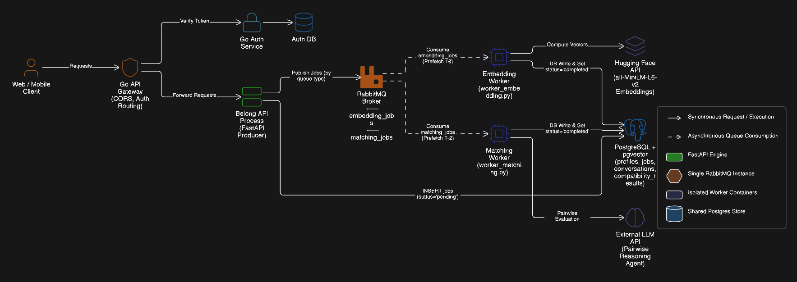
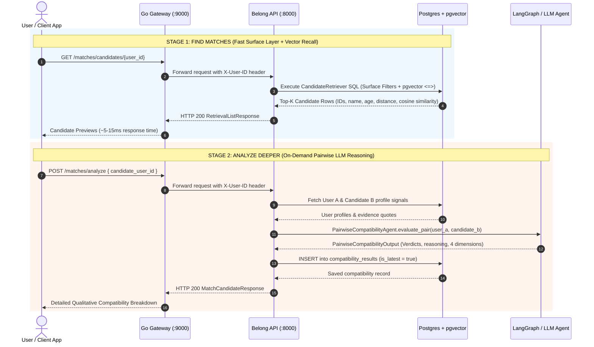
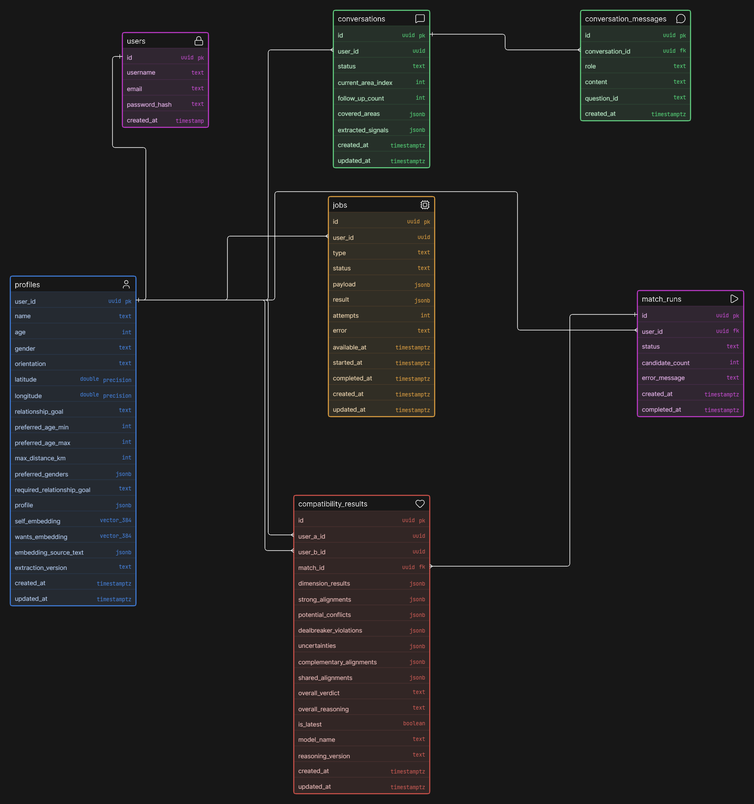

# Belong — Backend Matchmaking Engine for Serious Relationships

> **A decoupled microservice matchmaking system that evaluates long-term relationship compatibility using conversational AI onboarding, psychographic trait extraction, fast dual-vector similarity recall (`pgvector`), and deep pairwise LLM reasoning.**

---

## 💡 Why Belong? (The Modern Dating Problem & Solution)

### 💔 The Problem with Modern Dating Apps
Most popular dating apps function like visual slot machines:
- **Superficial Sorting:** Matches are made in split seconds based almost entirely on photos, prompt quips, or generic hobbies.
- **Illusion of Choice & Swipe Fatigue:** Endless swiping breeds burnout, ghosting, and disposable interactions rather than genuine human connections.
- **Surface Similarity vs. Real Compatibility:** Liking the same music, movies, or sports team does not mean two people share compatible values, emotional communication, or relationship expectations.

Traditional dating apps excel at quick dates and maximizing user retention, but frequently fail people looking for **intentional, deep, and lasting relationships**.

### ❤️ Why Belong is Better for Serious Relationships
Belong shifts the focus from visual sorting to **relationship psychology, emotional complementarity, and mutual alignment**:
- **Emotional & Psychological Complementarity:** Real compatibility isn't just about shared traits—it's about how two people balance each other (e.g., pairing someone who seeks emotional reassurance with a grounded, supportive listener).
- **Evidence-Grounded AI Profiling:** Users engage in a natural conversation with an AI guide (`self` vs. `wants`). The system extracts psychographic insights backed by verbatim user quotes.
- **Mutual Intentionality:** Matchmaking is strictly reciprocal. A match is only suggested if **User A fits what User B seeks AND User B fits what User A seeks**.
- 
---

## 🛠️ Tech Stack & Dependencies

- **Backend Microservices:** Go 1.22+ (API Gateway & Auth Service), Python 3.12 (FastAPI API Server & Worker Process)
- **AI & Graph Frameworks:** LangGraph, LangChain, Groq API (`openai/gpt-oss-120b`), Hugging Face / local `sentence-transformers` (`all-MiniLM-L6-v2`)
- **Database:** PostgreSQL 16 + `pgvector` extension (HNSW vector indexes)
- **Messaging:** RabbitMQ (AMQP) for asynchronous task queues
- **Containerization:** Docker & Docker Compose
- **Testing:** Custom multi-user simulation & benchmark suite (`httpx` + `asyncio`)

---
## 1. System Overview & Architecture

Belong's backend is built with a decoupled, asynchronous microservice architecture designed for high throughput, sub-15ms candidate retrieval, and scalable background reasoning.


*(Fallback GitHub Link: `https://github.com/Siuumanth/Belong/blob/main/images/architecure.png?raw=true`)*

### Service Boundaries & Architecture Diagram

```text
┌────────────────────────────────────────────────────────────────────────┐
│                        Web / Mobile Client                             │
└───────────────────────────────────┬────────────────────────────────────┘
                                    │ HTTP Requests
                                    ▼
┌────────────────────────────────────────────────────────────────────────┐
│                        Go API Gateway (Port 9000)                      │
│                  (CORS, Token Verification, Routing)                   │
└───────────┬────────────────────────────────────────────────┬───────────┘
            │                                                │
            ▼                                                ▼
┌───────────────────────┐                        ┌───────────────────────┐
│  Go Auth Service      │                        │  Belong API (FastAPI) │
│  (Port 9001)          │                        │  (Port 8000)          │
│  - User Reg & Auth    │                        │  - Profile Management │
│  - JWT Generation     │                        │  - Onboarding Graph   │
└───────────┬───────────┘                        │  - Candidate Retrieval│
            │                                    │  - Job Dispatcher     │
            ▼                                    └───────────┬───────────┘
┌───────────────────────┐                                    │ Publish Jobs
│  Auth Database        │                                    ▼
│  (PostgreSQL)         │                        ┌───────────────────────┐
└───────────────────────┘                        │   RabbitMQ Broker     │
                                                 │   ├── embedding_jobs  │
                                                 │   └── matching_jobs   │
                                                 └───────────┬───────────┘
                                                             │
                                        ┌────────────────────┴────────────────────┐
                                        │ Consume Queues                          │
                                        ▼                                         ▼
                            ┌───────────────────────┐                 ┌───────────────────────┐
                            │  Embedding Worker     │                 │  Matching Worker      │
                            │  (worker_embedding.py)│                 │  (worker_matching.py) │
                            │  - SentenceTransf.    │                 │  - Stage 1 pgvector   │
                            │  - Generates 384d Vec │                 │  - Stage 2 LLM Agent  │
                            └───────────┬───────────┘                 └───────────┬───────────┘
                                        │                                         │
                                        └────────────────────┬────────────────────┘
                                                             │ DB Read/Write
                                                             ▼
                                                ┌──────────────────────────┐
                                                │  PostgreSQL + pgvector   │
                                                │  - profiles              │
                                                │  - match_jobs            │
                                                │  - compatibility_results │
                                                └──────────────────────────┘
```

### Service Breakdown
- **`gateway` (Go `:9000`):** Single entry point. Handles CORS, JWT verification, and proxies `/api/...` requests to internal services.
- **`auth` (Go `:9001`):** Dedicated authentication microservice. Handles user registration, bcrypt password hashing, and JWT token signing.
- **`belong-api` (FastAPI `:8000`):** Main application backend. Manages profile signals, executes the LangGraph AI onboarding graph, serves real-time candidate retrieval (`CandidateRetriever`), and triggers pairwise LLM evaluations.
- **`belong-workers` (Python):** Background worker process running queue listeners:
  - `embedding_jobs`: Listens for updated profile signals and generates 384-dimensional vector embeddings (`self_embedding` and `wants_embedding`).
  - `matching_jobs`: Executes batch matching and background Stage 1 & Stage 2 compatibility runs.
- **`belong-postgres`:** PostgreSQL 16 database storing profiles, 384-d `pgvector` indexes, conversation sessions, and qualitative match evaluation reports.
- **`belong-rabbitmq`:** AMQP message broker orchestrating background tasks.

---

## 2. Onboarding & Signal Extraction Flow

The onboarding engine separates **user interaction** from **psychographic signal extraction**:

```text
 ┌──────────────────────┐        ┌──────────────────────┐        ┌──────────────────────┐
 │  User Response Text  │ ────►  │  LLM Trait Extractor │ ────►  │ Psychographic Profile│
 └──────────────────────┘        └──────────────────────┘        │ (Lifestyle, Values,  │
                                            │                    │  Interests, Needs)   │
                                            ▼                    └──────────────────────┘
                                 ┌──────────────────────┐
                                 │   Coverage Policy    │
                                 │ Evaluates completeness│
                                 └──────────┬───────────┘
                                            │
                                  Vague?    │   Clear?
                             ┌──────────────┴──────────────┐
                             ▼                             ▼
                ┌─────────────────────────┐   ┌─────────────────────────┐
                │ Generate Contextual     │   │ Advance to Next         │
                │ Follow-up Probe Question│   │ Onboarding Question     │
                └─────────────────────────┘   └─────────────────────────┘
```

### Extraction Principles
- **Conversational Guidance:** A 6-question AI-guided dialogue that dynamically asks follow-up probe questions if an answer is vague or incomplete.
- **Hint-Based Extraction:** Target dimensions act as extraction hints. If a user describes lifestyle habits and personal values in a single answer, both dimensions are extracted simultaneously.
- **Dual-Filing Rule:** Explicit dealbreakers (e.g., "must be a non-smoker", "monogamy only") are saved into `constraints.dealbreakers` and omitted from general trait preferences.
- **Evidence Traceability:** All extracted claims include verbatim quotes from user responses to ground LLM compatibility reasoning in verified facts.

### Data Representation & Embedding Serialization Example

#### 1. Stored Profile Signal JSON (`profiles.profile` in PostgreSQL)
User responses are parsed into structured JSON containing verbatim evidence quotes, confidence scores, and strict separation between `self`, `wants`, and `constraints`:

```json
{
  "self": {
    "values": [
      {
        "summary": "Values honesty, transparency, and continuous personal growth",
        "evidence": "I really value honesty above all else and being open about emotions.",
        "confidence": 0.95
      }
    ],
    "lifestyle": [
      {
        "summary": "Enjoys active weekend hiking and quiet evening reading",
        "evidence": "On weekends I love hiking in nature or reading at home.",
        "confidence": 0.90
      }
    ],
    "emotional_needs": [
      {
        "summary": "Needs explicit verbal reassurance when feeling stressed",
        "evidence": "When I am stressed, I need my partner to reassure me that we are okay.",
        "confidence": 0.92
      }
    ],
    "conflict_style": [
      {
        "summary": "Prefers calm, immediate discussion over silent treatment",
        "evidence": "I hate going to bed angry, I prefer talking things out calmly.",
        "confidence": 0.88
      }
    ]
  },
  "wants": {
    "partner_traits": [
      {
        "summary": "Grounded, patient, and emotionally available listener",
        "evidence": "I am looking for someone who is patient and stays calm during tough conversations.",
        "confidence": 0.95
      }
    ],
    "relationship_expectations": [
      {
        "summary": "Seeks intentional long-term commitment leading to family",
        "evidence": "I want a serious relationship where we build a future together.",
        "confidence": 0.98
      }
    ]
  },
  "constraints": {
    "dealbreakers": [
      {
        "summary": "Non-smoker only",
        "evidence": "I cannot date anyone who smokes.",
        "confidence": 1.0
      }
    ]
  }
}
```

#### 2. Canonical Text Serialization (`CanonicalSerializer`)
Before vectorization, the `CanonicalSerializer` filters items above confidence threshold ($\ge 0.7$), strips metadata/quotes, and formats section headings into clean canonical text:

* **Generated `self_text`:**
  ```text
  SELF

  Values: Values honesty, transparency, and continuous personal growth.
  Lifestyle: Enjoys active weekend hiking and quiet evening reading.
  Conflict style: Prefers calm, immediate discussion over silent treatment.
  Emotional needs: Needs explicit verbal reassurance when feeling stressed.
  ```

* **Generated `wants_text`:**
  ```text
  WANTS

  Partner traits: Grounded, patient, and emotionally available listener.
  Relationship expectations: Seeks intentional long-term commitment leading to family.
  ```

#### 3. Embedding Vector Generation (`self_embedding` & `wants_embedding`)
The serialized canonical strings are passed into the embedding model (`all-MiniLM-L6-v2`) to produce 384-dimensional floating point vectors:

```text
self_text  ──► [Embedding Model] ──► self_embedding  (VECTOR(384))
wants_text ──► [Embedding Model] ──► wants_embedding (VECTOR(384))
```

These vectors are saved directly into the `profiles` table in PostgreSQL:
```sql
UPDATE profiles
SET self_embedding = '[0.023, -0.087, 0.142, ...]'::vector,
    wants_embedding = '[-0.015, 0.114, -0.063, ...]'::vector,
    embedding_source_text = '{"self_text": "...", "wants_text": "..."}'::jsonb
WHERE user_id = 'user-uuid';
```

During Stage 1 candidate retrieval, PostgreSQL executes HNSW cosine distance search (`wants_embedding <=> self_embedding`) to rapidly find candidate matches based on what the user is seeking.

---

## 3. Two-Stage Matchmaking Pipeline

To scale matching efficiently without running expensive LLM evaluations on millions of candidate pairs, Belong uses a **two-stage pipeline**:

```text
[ Incoming Match Request ]
           │
           ▼
┌────────────────────────────────────────────────────────┐
│ STAGE 1: Surface Layer SQL & pgvector Cosine Recall    │
│ - Surface Layer: Filter gender, age, distance, dealbreakers│
│ - Vector Search: Cosine similarity on self vs wants    │
└──────────────────────────┬─────────────────────────────┘
                           │
                           ▼ Top Candidate Shortlist (K)
┌────────────────────────────────────────────────────────┐
│ STAGE 2: Pairwise LLM Compatibility Reasoning          │
│ - Evaluate reciprocal alignment (User A Needs ↔ User B)│
│ - Evaluate complementary traits (User B Needs ↔ User A)│
│ - Assign dimensional verdicts & overall score          │
└──────────────────────────┬─────────────────────────────┘
                           │
                           ▼
[ Persist Results to PostgreSQL & Return Qualitative Analysis ]
```

### Stage 1: Retrieval (Surface Layer SQL + `pgvector`)
- Applies hard surface layer constraints: age range, distance radius (Haversine), gender preference, and hard dealbreaker filters.
- Computes vector similarity between User A's `wants_embedding` and Candidate B's `self_embedding` using `pgvector` HNSW indexes.
- Returns candidate previews in **5ms to 15ms** without consuming LLM tokens.

### Stage 2: Reasoning (Pairwise LLM Compatibility Agent)
- Executes an LLM reasoning node with strict JSON schema validation.
- Evaluates bi-directional alignment across **4 core relationship dimensions**:
  1. **Emotional Needs:** Support mechanisms, stress handling, and reassurance dynamics.
  2. **Core Values:** Principles regarding family, ambition, personal growth, and ethics.
  3. **Lifestyle & Routine:** Daily habits, social battery, work-life balance, and schedules.
  4. **Conflict & Communication:** How partners navigate disagreements, process emotions, and handle space.
- Outputs qualitative verdicts (`strong_alignment`, `partial`, `unclear`, `conflict`) along with mapped evidence quotes.

---

## 4. System Execution Flows

Belong supports two decoupled execution models: **Decoupled Real-Time Candidate Fetching + On-Demand LLM Reasoning** and **Asynchronous Queue Choreography**.

### Flow A: Real-Time Candidate Fetching & On-Demand LLM Reasoning

This model enables instantaneous candidate browsing followed by on-demand deep analysis when requested by the user:



### Flow B: Asynchronous Worker Choreography (Background Queue Mode)

For long-running batch operations or decoupled background job processing:

```text
Client                  FastAPI (belong-api)              RabbitMQ               Worker (belong-workers)           PostgreSQL
  │                              │                           │                              │                           │
  ├─ POST /matches ─────────────►│                           │                              │                           │
  │                              ├─ Create Job (pending) ────┼──────────────────────────────┼──────────────────────────►│
  │                              │                           │                              │                           │
  │                              ├─ Publish matching_job ───►│                              │                           │
  │◄─ 202 Accepted (job_id) ─────┤                           │                              │                           │
  │                              │                           ├─ Consume matching_job ──────►│                           │
  │                              │                           │                              ├─ Execute Stage 1 & 2      │
  │                              │                           │                              ├─ Write Results & Status ─►│
  │                              │                           │                              │  (status = 'completed')   │
  │                              │                           │                              │                           │
  ├─ GET /matches/jobs/{id} ────►│                           │                              │                           │
  │◄─ 200 OK (status: completed)─┴───────────────────────────┴──────────────────────────────┴──────────────────────────►│
```

---

## 5. Database Schema & Storage

Database constraints and relational schemas are defined in PostgreSQL 16 using `pgvector`.


*(Fallback GitHub Link: `https://github.com/Siuumanth/Belong/blob/main/images/schema.png?raw=true`)*

```text
┌────────────────────────────────────────────────────────┐
│                        profiles                        │
├────────────────────────────────────────────────────────┤
│ user_id (UUID, PK)                                     │
│ name (TEXT), age (INT), gender (TEXT)                  │
│ orientation (TEXT), relationship_goal (TEXT)           │
│ latitude (DOUBLE PRECISION), longitude (DOUBLE)        │
│ preferred_age_min (INT), preferred_age_max (INT)      │
│ max_distance_km (INT), preferred_genders (JSONB)       │
│ profile (JSONB - Psychographic Dimensions)             │
│ self_embedding (VECTOR(384))                           │
│ wants_embedding (VECTOR(384))                          │
│ created_at, updated_at (TIMESTAMPTZ)                   │
└────────────────────────────────────────────────────────┘
                           │
                           │ 1:N
                           ▼
┌────────────────────────────────────────────────────────┐
│                 compatibility_results                  │
├────────────────────────────────────────────────────────┤
│ id (UUID, PK)                                          │
│ user_a_id (UUID, FK -> profiles.user_id)               │
│ user_b_id (UUID, FK -> profiles.user_id)               │
│ overall_verdict (VARCHAR)                              │
│ compatibility_score (FLOAT)                            │
│ dimension_results (JSONB)                              │
│ reciprocal_alignments (JSONB)                          │
│ evidence_mappings (JSONB)                              │
│ is_latest (BOOLEAN)                                    │
│ created_at (TIMESTAMPTZ)                               │
└────────────────────────────────────────────────────────┘
```

---

## 6. API Endpoint Summary

| Category | Endpoint | Method | Stage / Mode | Description & Behavior |
| :--- | :--- | :--- | :--- | :--- |
| **Match Retrieval** | `/matches/candidates/{user_id}` | `GET` | Stage 1 (Real-Time) | Instant candidate retrieval via SQL surface filters + `pgvector` (~5-15ms response). **No LLM used**. |
| **Match Retrieval** | `/matches/candidates` | `POST` | Stage 1 (Real-Time) | Candidate retrieval accepting options in request body. **No LLM used**. |
| **Deep Analysis** | `/matches/analyze` | `POST` | Stage 2 (On-Demand) | Runs pairwise LLM compatibility reasoning on a selected candidate and saves results to DB. |
| **Deep Analysis** | `/matches/analyze/{candidate_id}` | `POST` | Stage 2 (On-Demand) | Path-parameter variant for on-demand candidate LLM reasoning. |
| **Match Results** | `/matches/details/pair/{candidate_id}` | `GET` | Query | Retrieves existing saved qualitative compatibility breakdown for a specific candidate pair. |
| **Match Results** | `/matches/{user_id}` | `GET` | Query | Retrieves all latest saved compatibility evaluations for a user. |
| **Async Jobs** | `/matches` | `POST` | Async Queue | Submits a background matching job to RabbitMQ queue. Returns `202 Accepted` with `job_id`. |
| **Async Jobs** | `/matches/jobs/{job_id}` | `GET` | Query | Checks status (`pending`, `completed`, `failed`) and results of an async background job. |
| **Onboarding** | `/onboarding/chat` | `POST` | Onboarding | Advances the LangGraph AI onboarding conversation and extracts psychographic profile signals. |
| **Authentication** | `/auth/register`, `/auth/login` | `POST` | Auth | User registration, password hashing, and JWT token issuance via Go Auth service. |

---

## 7. Local Setup & Container Deployment

### Prerequisites
- Docker & Docker Compose installed

### Running the Complete Stack
```powershell
# Build and start all microservices (Gateway, Auth, API, Workers, Postgres, RabbitMQ)
docker compose up -d --build
```

### Verification & Health Check
```powershell
# Test Gateway routing on Port 9000
curl http://localhost:9000/health
```

### Running Multi-User Simulation Suite
```powershell
# Execute the end-to-end multi-persona simulation script
cd tests
python run_custom_simulation.py
```