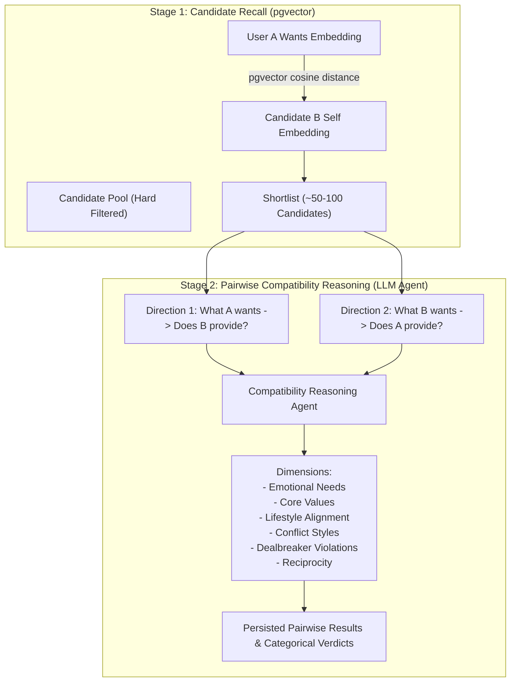

# Belong — Retrieval & Matchmaking Architecture

## 1. Core Architectural Principle: Recall vs. Compatibility

The fundamental differentiator of Belong is that **semantic similarity is strictly a candidate recall mechanism, not the compatibility mechanism**.

```
                           A wants text
                                ↓
                            embedding
                                ↓
                        cosine similarity
                                ↓
                           B self text
```

If a system stops at vector distance, it is doing **semantic similarity** — merely finding people whose self-descriptions sound similar to what someone wrote. But in human relationships:
- Being interested in someone and actually being compatible with them are two fundamentally different things.
- Two people liking the same music or books does not mean their emotional needs, conflict styles, or life directions align.
- **Vector search answers:** *"Does B's self-representation semantically resemble what A is looking for?"*
- It does **not** claim compatibility.

True compatibility is evaluated afterward through bidirectional, multi-dimensional reasoning.



---

## 2. Canonical Semantic Serialization

The structured profile is optimized for storage, querying, and compatibility reasoning, while embedding models operate on text. Belong converts the structured profile into a canonical textual representation before generating embeddings.

```text
User answers
     ↓
LLM extraction
     ↓
StructuredProfileJSON
     ↓
Canonical Semantic Serializer
     ↓
┌─────────────────┐
│                 │
SELF            WANTS
│                 │
└───────┬─────────┘
        ↓
all-MiniLM-L6-v2
        ↓
384-d vectors
        ↓
PostgreSQL + pgvector
        ↓
Candidate retrieval
        ↓
Pairwise compatibility LLM
```

---

## 3. Serialization Rules & Representation Strategy

### Core Serialization Principles
1. **Direct Category Structure**: Format `SELF` and `WANTS` using clean category headers followed by comma-separated summaries of extracted signals rather than verbose or mirrored sentences.
2. **Omit Empty Fields**: Never include headers or keys for empty profile fields (e.g. if `life_goals` is empty, omit the line completely).
3. **Keep Evidence Out of Embedding Text**: Store quotes, question IDs, and confidence scores in the profile JSON for explainability and LLM reasoning, but embed only concise semantic summaries.
4. **Confidence Filtering**: Exclude weak or uncertain extractions (e.g., `confidence < 0.5`) from the embedding text to prevent noise.

### Canonical Text Format (Representation A - Default)

**`SELF` Text Example:**
```text
SELF

Values: honesty, independence.
Lifestyle: enjoys travelling, active lifestyle.
Personality: supportive, social.
Interests: hiking, music.
Life goals: stable career, meaningful relationships.
Conflict style: prefers discussing problems openly.
Provides: emotional support, listens before giving advice.
```

**`WANTS` Text Example:**
```text
WANTS

Partner traits: emotionally available, independent.
Emotional needs: reassurance, emotional support.
Relationship expectations: open communication, mutual support.
Desired lifestyle: active, enjoys travelling.
Partner values: honesty, independence.
```

### Representation Benchmark Strategy
The serialization format is treated as an experimental retrieval component. Different candidate representations can be benchmarked on candidate retrieval metrics (`Recall@100`):
- **Representation A (Structured Field-Based - Default)**: Category key-value summaries.
- **Representation B (Natural Language)**: Prose narrative summaries.
- **Representation C (Mirrored Frames)**: Verbose prompt frames.

---

## 4. End-to-End Matchmaking Workflow

```
1. Client POST /matches
   - Receives 202 Accepted with job_id immediately.
   - Durably written to `jobs` table (status='pending').

2. Worker claims job via PostgreSQL row locking:
   SELECT * FROM jobs WHERE status = 'pending' 
   FOR UPDATE SKIP LOCKED LIMIT 1;

3. Step 1: Deterministic SQL Hard Filters
   - Target gender and orientation compatibility.
   - Age range constraints (User A range <-> User B age AND vice versa).
   - Maximum travel distance (calculated via coordinates / Haversine formula).
   - Required relationship goal matching.

4. Step 2: pgvector Candidate Recall
   - Query: User A wants_embedding
   - Target: Candidate pool self_embedding
   - Index: HNSW cosine distance (`<=>`)
   - Retrieves top 50–100 candidate profiles.

5. Step 3: Optional Pre-Rank Reduction
   - Score-based or rule-based filter to pick top 10–20 highest-potential candidates.

6. Step 4: Pairwise Compatibility Agent (LLM Reasoning)
   For each candidate:
   - Evaluate A wants ──> B provides
   - Evaluate B wants ──> A provides
   - Inspect dimensions: Emotional Needs, Values, Lifestyle, Conflict Style, Dealbreakers.
   - Produce strictly structured categorical verdicts:
     - `strong_alignment`
     - `partial_alignment`
     - `unclear` (evidence missing in profile)
     - `conflict`
   - Validate that all claims cite verbatim evidence quotes from the onboarding conversation.

7. Step 5: Persist Results & Complete Job
   - Write structured pairwise analysis to `compatibility_results`.
   - Update job status to `completed`.
   - Client polls GET /matches/jobs/{job_id} and receives rich compatibility cards.
```
