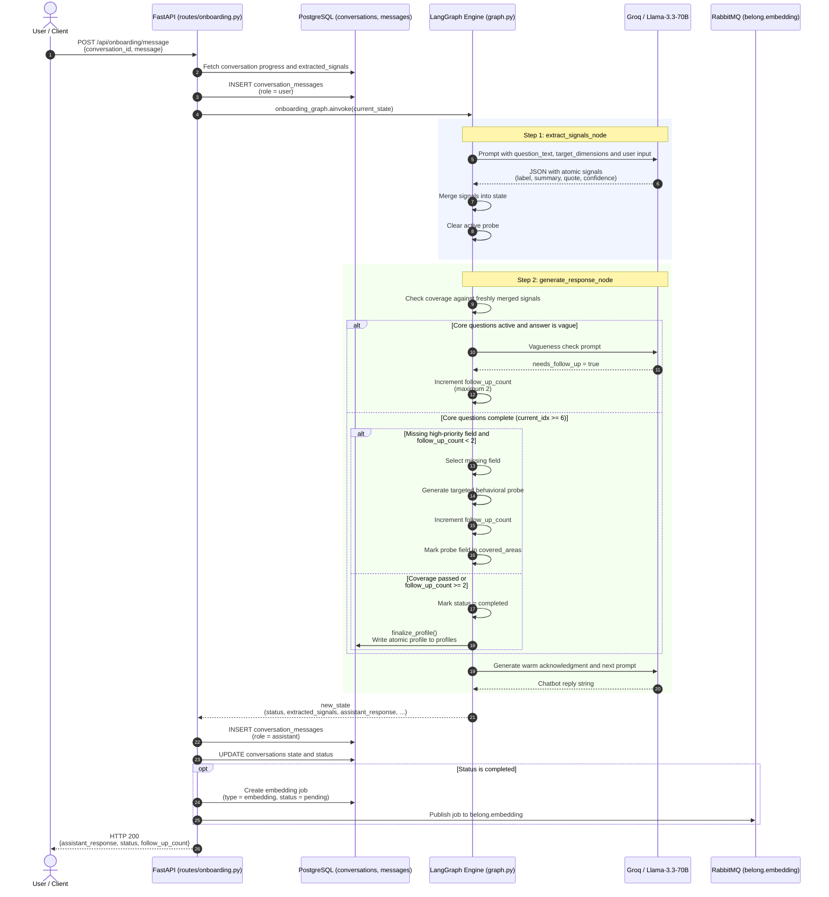
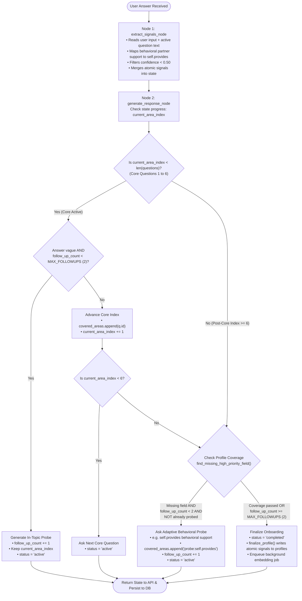

# Onboarding Graph & Session Workflow

This document details the LangGraph state machine, HTTP lifecycle, and persistence architecture powering the conversational onboarding in Belong (`belong-api/onboarding/graph.py`).

---

## 1. Request-Response Lifecycle Sequence

The conversational onboarding uses a **stateless, turn-by-turn request model**. Instead of maintaining persistent background loops or long-lived server memory, every user message triggers an atomic execution of the LangGraph state machine.



### Explanation of Diagram 1
1. **Stateless Reconstitution**: FastAPI reads the user's progress (`current_area_index`, `follow_up_count`, `covered_areas`, and `extracted_signals`) directly from PostgreSQL.
2. **Two-Node Graph Invocation**:
   - `extract_signals_node`: Extracts atomic traits with verbatim user quotes and confidence scores $\ge 0.50$.
   - `generate_response_node`: Re-evaluates profile completeness, checks answer depth, manages follow-up counts, and drafts the next question.
3. **Atomic Finalization**: When onboarding completes, the graph calls `finalize_profile()` to compile signals into the `profiles` table and enqueues an asynchronous vector embedding job via RabbitMQ.

---

## 2. LangGraph State Machine & Coverage Logic

The internal decision flow of the LangGraph state machine enforces strict termination invariants and adaptive probing.



### Explanation of Diagram 2
- **Core Question Traversal**: The user progresses sequentially through 6 core dimensions (`q1_values` through `q6_conflict`).
- **In-Topic Follow-Ups**: If an answer is too brief or evasive during core questions, the graph asks an in-topic follow-up without advancing the index (up to `MAX_FOLLOWUPS = 2`).
- **Post-Core Adaptive Probing**: Once core questions finish, if critical dimensions (like `self.provides`) lack sufficient evidence, the graph asks a concrete behavioral probe.
- **Duplicate Probe Guard**: Once a dimension probe is asked (tagged `probe:{field}` in `covered_areas`), it is permanently suppressed from being asked again.
- **Hard Cap Termination**: If `follow_up_count >= 2`, onboarding unconditionally marks `status = 'completed'` and finalizes the profile.

---

## 3. Developer Notes & Invariant Rules

### Invariant 1: Total Turn Upper Bound
```text
6 core questions + at most 2 follow-ups = maximum 8 user turns.
Never Q9 or Q10.
```

### Invariant 2: Hard Follow-Up Cap
In `belong-api/onboarding/graph.py`:
```python
MAX_FOLLOWUPS = settings.MAX_FOLLOW_UPS  # Value: 2
# Checked before any follow-up probe or in-topic question is scheduled
```

### Invariant 3: Duplicate Probe Guard
Adaptive probes are tagged with `probe:{field}` inside `covered_areas`. If a user cannot provide a field, it is marked as probed and the graph either moves to the next missing dimension or completes. It will never loop on the same question.

### Invariant 4: Atomic Evidence Signals
Every extracted signal adheres to this strict atomic structure:
```json
{
  "id": "q4_lifestyle_values_s_lifestyle_00",
  "label": "Enjoys trail running",
  "summary": "The user enjoys trail running.",
  "quote": "Trail running",
  "question_id": "q4_lifestyle_values",
  "confidence": 0.98,
  "evidence_type": "explicit"
}
```
* **Verbatim Quotes**: The `quote` field is strictly excerpted from the user's text.
* **No Placeholders**: Generic text like `"evidence": "survey response"` is strictly rejected.
* **Confidence Floor**: Signals with confidence below `0.50` are automatically pruned.
