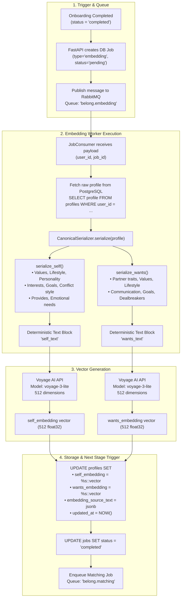
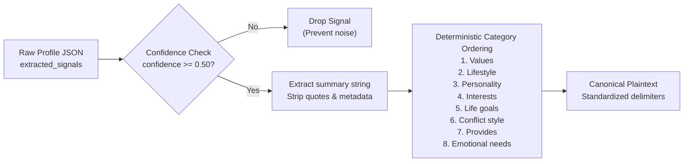

# Deterministic Semantic Serialization & Vector Embedding Pipeline

This document explains the deterministic serialization and asynchronous vector embedding workflow handled by the embedding worker (`belong-workers/workers/embedding_worker.py` and `embeddings/serializer.py`).

---

## 1. Vector Pipeline Workflow Diagram

The embedding generation process translates semi-structured profile JSON into two independent 512-dimensional vector representations (`self_embedding` and `wants_embedding`) using Voyage AI.

### Explanation of Diagram
1. **Trigger & Message Routing**: When a user's onboarding conversation reaches `completed`, the API stores a pending job row in PostgreSQL and delivers an event to the RabbitMQ `belong.embedding` queue.
2. **Canonical Serialization**: Raw JSON from the `profiles` table is parsed deterministically into two dedicated text sections:
   - `self_text`: Summarizes who the user is and what they bring to a relationship (`self.provides`, `self.values`, etc.).
   - `wants_text`: Summarizes what kind of partner and dynamic the user desires (`wants.partner_traits`, `wants.values`, etc.).
3. **Voyage AI Embedding**: Both text blocks are embedded asynchronously using the `voyage-3-lite` model, producing two 512-dimension vectors.
4. **Database Persistence & Matching Trigger**: Vectors are saved into PostgreSQL via pgvector. Once saved, a downstream matching job is enqueued to `belong.matching`.

---

## 2. Canonical Serialization Detail

The `CanonicalSerializer` enforces strict deterministic ordering and confidence filtering:

### Explanation of Diagram
- Signals with confidence below `0.50` are omitted to avoid vector pollution.
- Categories are formatted in a fixed sequential order so identical underlying traits produce identical text representations across recalculations, preventing vector drift.

---

## 3. Developer Notes

### Dual Vector Strategy (`self` vs `wants`)
Belong deliberately splits profiles into two distinct vector embeddings:
* **`self_embedding`**: Captures the user's personality, behavior, lifestyle, and conflict style.
* **`wants_embedding`**: Captures the user's partner preferences and relationship expectations.

This enables **cross-directional similarity search** during Stage 1 retrieval:
$$\text{Compatibility}(A, B) \approx \text{sim}(A.\text{wants}, B.\text{self}) + \text{sim}(B.\text{wants}, A.\text{self})$$

### Vector Specs
- **Model**: `voyage-3-lite` (Voyage AI).
- **Dimensions**: 512.
- **pgvector Index Type**: HNSW with cosine distance operator (`vector_cosine_ops`).
- **PostgreSQL Column Types**: `vector(512)` on `profiles.self_embedding` and `profiles.wants_embedding`.
