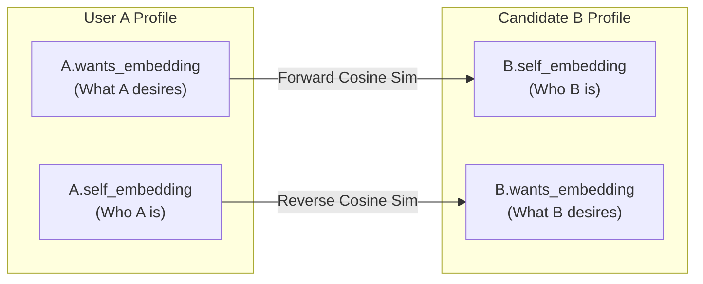

# Stage 1 Candidate Retrieval & Filtering Pipeline

This document details the architecture, SQL filtering, and bidirectional vector scoring mechanism used by `CandidateRetriever` in [`belong-workers/matching/retrieval.py`](file:///d:/code/Golang/Belong/belong-workers/matching/retrieval.py).

---

## 1. Candidate Retrieval & Filtering Funnel

Stage 1 narrows down the entire database of profiles to a pre-ranked pool of top candidates (default 15) using PostgreSQL hard constraints and pgvector index scans.

```mermaid
flowchart TD
    subgraph Input ["1. Inputs for User A"]
        A1["User A Profile & Constraints<br/>• Age, Gender, Orientation<br/>• Relationship Goal<br/>• Max Distance & Geo Lat/Lon"]
        A2["User A Vectors<br/>• wants_embedding (512-dim)<br/>• self_embedding (512-dim)"]
    end

    subgraph HardFilters ["2. PostgreSQL Hard Constraint Filtering"]
        B1["Mutual Gender Compatibility<br/>p.gender = ANY(user_pref_genders) AND<br/>p.preferred_genders ? user_gender"]
        B2["Mutual Age Window<br/>user_pref_age_min <= p.age <= user_pref_age_max AND<br/>p.pref_age_min <= user_age <= p.pref_age_max"]
        B3["Relationship Goal Alignment<br/>Mutual match on relationship_goal"]
        B4["Haversine Geolocation Distance<br/>Distance <= LEAST(UserA.max_dist, Candidate.max_dist)"]
        B5["Self Exclusion & Integrity<br/>p.user_id != user_id AND p.self_embedding IS NOT NULL"]
    end

    subgraph VectorScoring ["3. Bidirectional pgvector Cosine Scoring"]
        C1["Forward Distance: (p.self_embedding <=> UserA.wants_embedding)<br/>Forward Sim = 1.0 - forward_dist"]
        C2["Reverse Distance: (p.wants_embedding <=> UserA.self_embedding)<br/>Reverse Sim = 1.0 - reverse_dist"]
        C3["Combined Score = w * Forward Sim + (1 - w) * Reverse Sim<br/>(Default weight w = 0.5)"]
    end

    subgraph OutputPool ["4. Candidate Selection"]
        D1["ORDER BY Forward Cosine Distance ASC<br/>LIMIT candidate_pool_limit (e.g. 50)"]
        D2["Re-rank by Combined Bidirectional Score<br/>Filter min_similarity_threshold (e.g. >= 0.0)"]
        D3["Top-K Pre-Rank Output<br/>LIMIT pre_rank_limit (e.g. 15 candidates)"]
        D4["Hand off to Stage 2 LLM Reciprocal Reasoning"]
    end

    Input --> HardFilters
    HardFilters --> VectorScoring
    VectorScoring --> OutputPool
```



### Explanation of Diagram
1. **Inputs**: The retriever extracts User A's demographic constraints, relationship goals, and both vector embeddings (`wants_embedding` and `self_embedding`).
2. **Hard Constraint Filtering**: A single dynamic SQL query enforces mutual criteria (gender preferences, mutual age windows, relationship goals, geographic radius via Haversine spherical math).
3. **Bidirectional Vector Cosine Scoring**:
   - Computes how well the candidate's traits satisfy User A's desires ($A.\text{wants} \leftrightarrow B.\text{self}$).
   - Computes how well User A's traits satisfy the candidate's desires ($B.\text{wants} \leftrightarrow A.\text{self}$).
4. **Pre-Rank Output**: Combines both directions with equal weight ($0.5 / 0.5$) and selects the top-K candidates to forward to Stage 2 LLM Pairwise Reasoning.

---

## 2. Bidirectional Vector Math Reference



### Mathematical Formula
$$\text{Sim}_{\text{forward}} = 1 - \text{CosineDist}(A.\text{wants}, B.\text{self})$$
$$\text{Sim}_{\text{reverse}} = 1 - \text{CosineDist}(B.\text{wants}, A.\text{self})$$
$$\text{Score}_{\text{combined}} = w \cdot \text{Sim}_{\text{forward}} + (1 - w) \cdot \text{Sim}_{\text{reverse}} \quad (w = 0.5)$$

---

## 3. Developer Notes

### Performance & Indexing
- The `profiles` table contains an **HNSW vector index** on `self_embedding` and `wants_embedding` using cosine distance:
  ```sql
  CREATE INDEX ON profiles USING hnsw (self_embedding vector_cosine_ops);
  CREATE INDEX ON profiles USING hnsw (wants_embedding vector_cosine_ops);
  ```
- Distance operator: `<=>` computes Cosine Distance in pgvector ($0.0 = \text{identical}$, $1.0 = \text{orthogonal}$, $2.0 = \text{opposite}$).
- Mutual filters run inside PostgreSQL's index scan, preventing out-of-bounds candidates from ever being sent to the LLM.
