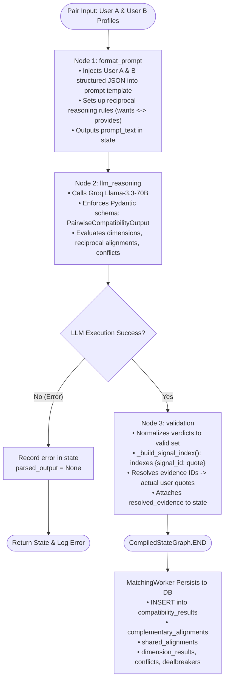
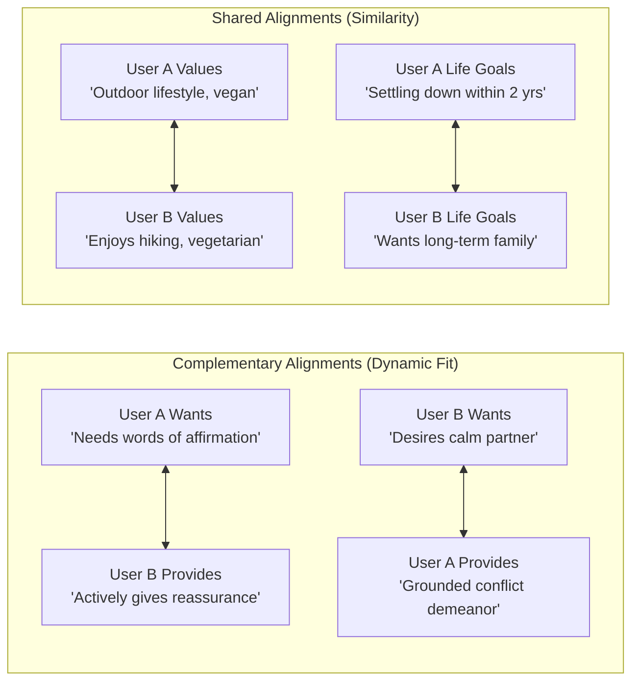

# Stage 2 Pairwise Reciprocal Reasoning LangGraph & Worker Workflow

This document details the Stage 2 Pairwise Reasoning workflow executed by `PairwiseCompatibilityAgent` in [`belong-workers/matching/compatibility.py`](file:///d:/code/Golang/Belong/belong-workers/matching/compatibility.py) and [`belong-workers/workers/matching_worker.py`](file:///d:/code/Golang/Belong/belong-workers/workers/matching_worker.py).

---

## 1. LangGraph State Machine Architecture

Stage 2 executes a compiled 3-node LangGraph state machine for each candidate retrieved from Stage 1.

### Explanation of Diagram 1
1. **`format_prompt`**: Formats the prompt using `PAIRWISE_REASONING_PROMPT_TEMPLATE`, embedding the structured `self`, `wants`, and `constraints` of both individuals.
2. **`llm_reasoning`**: Groq's `llama-3.3-70b-versatile` generates structured compatibility analysis via `with_structured_output(PairwiseCompatibilityOutput)`.
3. **`validation`**:
   - Ensures the overall verdict matches `{"strong_alignment", "partial_alignment", "unclear", "conflict"}`.
   - Builds a flat lookup index mapping signal IDs to user quotes (`_build_signal_index`), verifying citations.
4. **Database Persistence**: Upserts the evaluated compatibility into the `compatibility_results` table in PostgreSQL.

---

## 2. Reciprocal Alignment vs. Shared Alignment Model

A core architectural principle in Belong is the strict distinction between **complementary reciprocity** and **shared similarity**.

### Explanation of Diagram 2
- **Complementary Alignments (`complementary_alignments`)**: Captures reciprocal fulfillment: what Person A specifically asks for must be actively provided by Person B, and vice-versa ($A.\text{wants} \leftrightarrow B.\text{self.provides}$).
- **Shared Alignments (`shared_alignments`)**: Captures commonality: shared interests, mutual worldviews, and synchronized timeline goals ($A.\text{self.values} \leftrightarrow B.\text{self.values}$).
- These two arrays are stored as separate JSONB columns in `compatibility_results` and returned distinctly by the Match API.

---

## 3. Developer Notes & Anti-Over-Inference Invariants

### 1. Anti-Over-Inference Rules
The reasoning prompt enforces strict logical discipline:
* **"Calm / Thoughtful" $\neq$ "Active Listening"**: A candidate being quiet or introspective cannot be cited as evidence of "active listening" unless they explicitly stated they listen attentively.
* **"Empathetic" $\neq$ "Reassurance"**: Being warm or compassionate is not proof that someone provides verbal reassurance during anxiety.
* **Unclear over Hallucination**: If evidence is missing for a partner's need, the LLM must classify the alignment as `uncertainties` rather than assuming it exists.

### 2. Evidence Traceability
Every claim in `dimension_results` cites atomic IDs (`evidence_a_ids`, `evidence_b_ids`). The `validation_node` indexes every signal from both profiles and resolves these citations into verbatim quotes, ensuring every match explanation is fully auditable.
