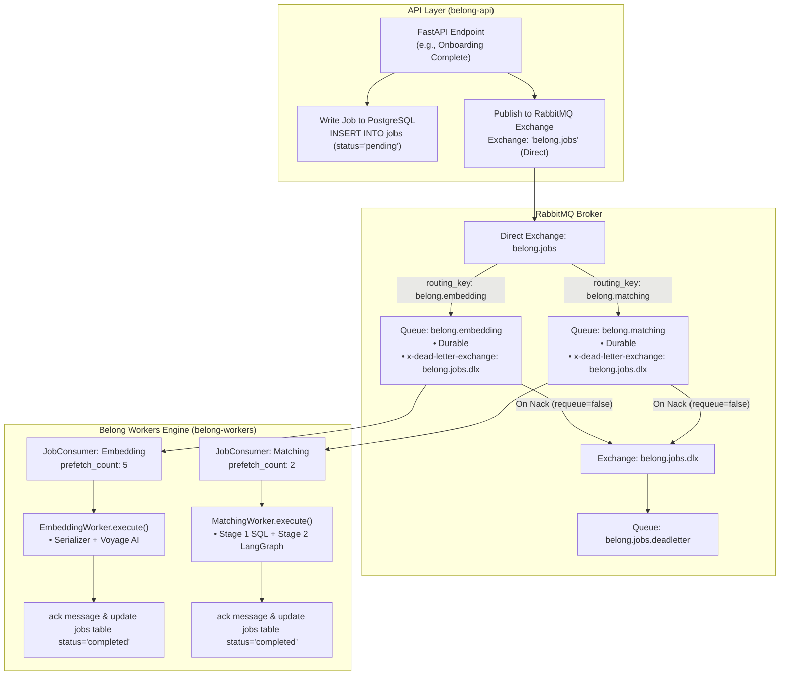
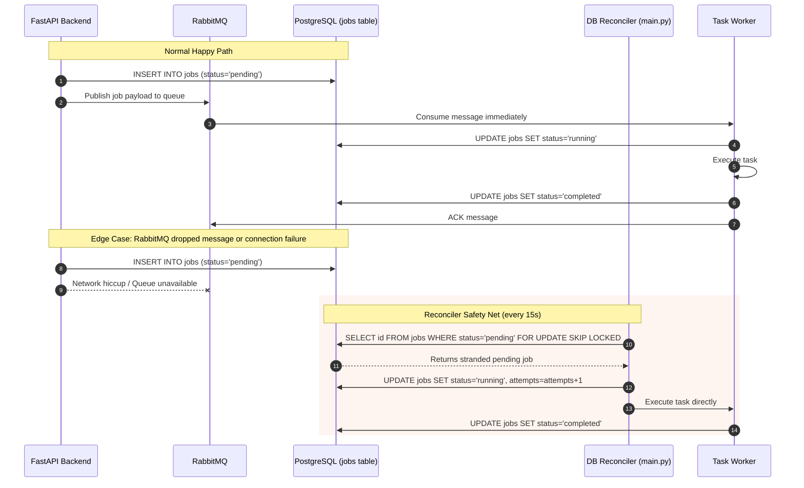

# RabbitMQ Topology, Workers Engine & Reconciler Pipeline

This document details the background task execution architecture, RabbitMQ messaging topology, and database reconciliation loop implemented in [`belong-workers/main.py`](file:///d:/code/Golang/Belong/belong-workers/main.py) and [`belong-workers/rabbitmq/`](file:///d:/code/Golang/Belong/belong-workers/rabbitmq/).

---

## 1. RabbitMQ Topology & Message Routing

Belong uses RabbitMQ for decoupled asynchronous task execution between the FastAPI backend and background compute workers.



### Explanation of Diagram 1
1. **Dual Dispatch**: When a long-running task is triggered, FastAPI writes a job row to PostgreSQL (`status = 'pending'`) and simultaneously publishes an event to RabbitMQ.
2. **Direct Exchange & Routing**: The `belong.jobs` direct exchange delivers jobs to `belong.embedding` or `belong.matching` based on the message routing key.
3. **Dead Letter Queue (DLQ)**: Poison-pill messages or exhausted retries are dead-lettered to `belong.jobs.deadletter` rather than blocking worker queues.
4. **Controlled Concurrency**: Prefetch limits prevent LLM-heavy workers from overwhelming rate limits or system memory.

---

## 2. Dual-Dispatch Reliability & PostgreSQL Reconciler

To guarantee **100% at-least-once delivery**, `belong-workers` runs a background reconciler loop alongside RabbitMQ consumers.



### Explanation of Diagram 2
- **Happy Path**: RabbitMQ delivers jobs in sub-millisecond time.
- **Failover / Reconciler Path**: If RabbitMQ loses connection, experiences broker restarts, or drops messages, the `reconcile_pending_jobs` loop safely claims stranded pending jobs using PostgreSQL's atomic `FOR UPDATE SKIP LOCKED`.
- **Zero Duplicate Execution**: `FOR UPDATE SKIP LOCKED` guarantees that across multiple worker instances, only one worker can claim and execute a stranded job.

---

## 3. Developer Notes

### Queue Configuration
| Queue Name | Routing Key | Prefetch | DLX Routing |
| :--- | :--- | :--- | :--- |
| `belong.embedding` | `belong.embedding` | 5 | `belong.jobs.dlx` |
| `belong.matching` | `belong.matching` | 2 | `belong.jobs.dlx` |
| `belong.jobs.deadletter` | `#` | N/A | Storage / Inspection |

### Reconciler SQL Claim
In `belong-workers/main.py`:
```sql
UPDATE jobs
SET status = 'running',
    started_at = CURRENT_TIMESTAMP,
    attempts = attempts + 1,
    updated_at = CURRENT_TIMESTAMP
WHERE id = (
    SELECT id FROM jobs
    WHERE status = 'pending' AND available_at <= CURRENT_TIMESTAMP AND attempts < 3
    ORDER BY created_at ASC
    FOR UPDATE SKIP LOCKED
    LIMIT 1
)
RETURNING id, user_id, type, payload;
```
