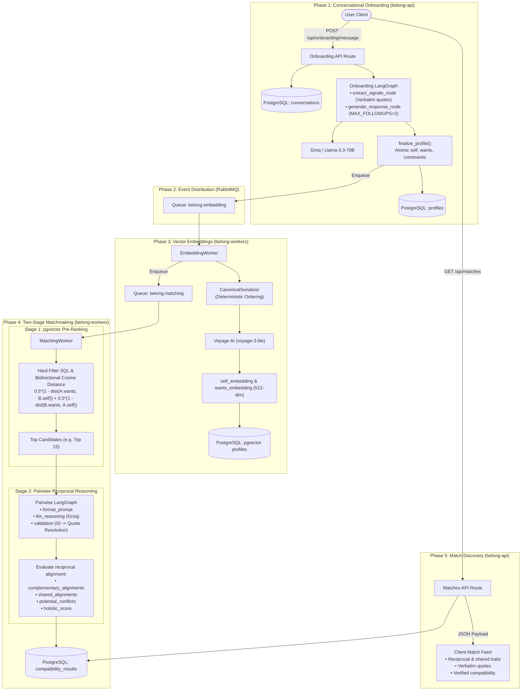
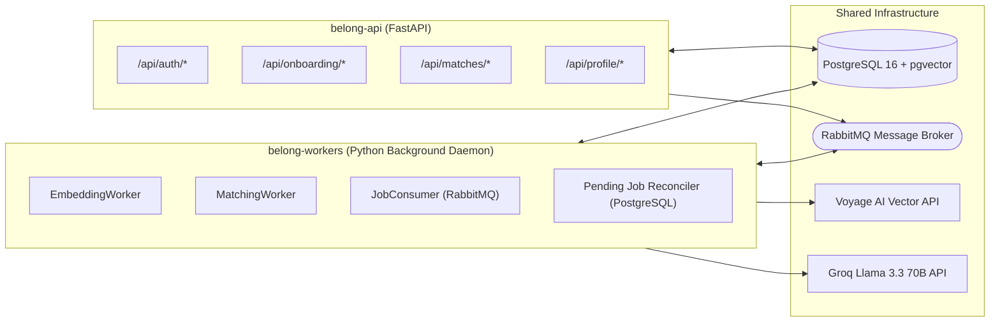

# End-to-End System Workflow & Architecture

This document presents the complete architectural journey of a user in Belong—from the first conversational onboarding turn to receiving reciprocally verified matchmaking recommendations.

---

## 1. End-to-End System Flowchart

### Explanation of Diagram
1. **Conversational Ingestion**: The user converses with the onboarding state machine. Signals with verbatim quotes are extracted and compiled into an atomic profile upon reaching the 2 follow-up hard cap.
2. **Deterministic Vectorization**: The profile is deterministically serialized and converted into dual 512-dimension vectors (`self` and `wants`) via Voyage AI.
3. **Stage 1 Fast Recall**: Candidate pairs are pre-filtered via hard constraints (gender, age, distance, goals) and pre-ranked via bidirectional cosine distance in pgvector.
4. **Stage 2 Deep Reasoning**: Groq's Llama-3.3-70B evaluates reciprocal dynamics ($A.\text{wants} \leftrightarrow B.\text{provides}$), separating complementary from shared alignments and resolving evidence IDs to user quotes.
5. **Client Presentation**: The client receives verified compatibility cards with transparent reasoning and verbatim evidence.

---

## 2. Microservice & Worker Responsibilities

### Explanation of Diagram
- **`belong-api`**: Handles synchronous client HTTP requests, user sessions, chat progression, and serving compatibility results.
- **`belong-workers`**: Handles asynchronous background workloads (semantic serialization, vector generation, Stage 1 SQL retrieval, and Stage 2 LLM reasoning).
- **`Infrastructure`**: Durable storage (PostgreSQL with pgvector extension), reliable broker (RabbitMQ), and specialized AI APIs (Groq & Voyage AI).

---

## 3. Developer Summary & Key Boundaries

| Workflow Step | Executing Component | Key Invariant / SLA |
| :--- | :--- | :--- |
| **Onboarding Turn** | `belong-api` (LangGraph) | $\le 8$ user turns total; $\le 2$ follow-up limit |
| **Signal Extraction** | `extract_signals_node` | Verbatim quotes; confidence $\ge 0.50$ |
| **Vector Embedding** | `belong-workers` (EmbeddingWorker) | Dual 512-dim vectors; deterministic serialization |
| **Candidate Retrieval** | `belong-workers` (Stage 1 SQL) | Bidirectional cosine distance; HNSW index |
| **Reciprocal Reasoning** | `belong-workers` (Stage 2 LangGraph) | Separation of complementary vs shared alignments; no over-inference |
| **Match Discovery** | `belong-api` (`/api/matches`) | Fully resolved quotes and audit trail |
