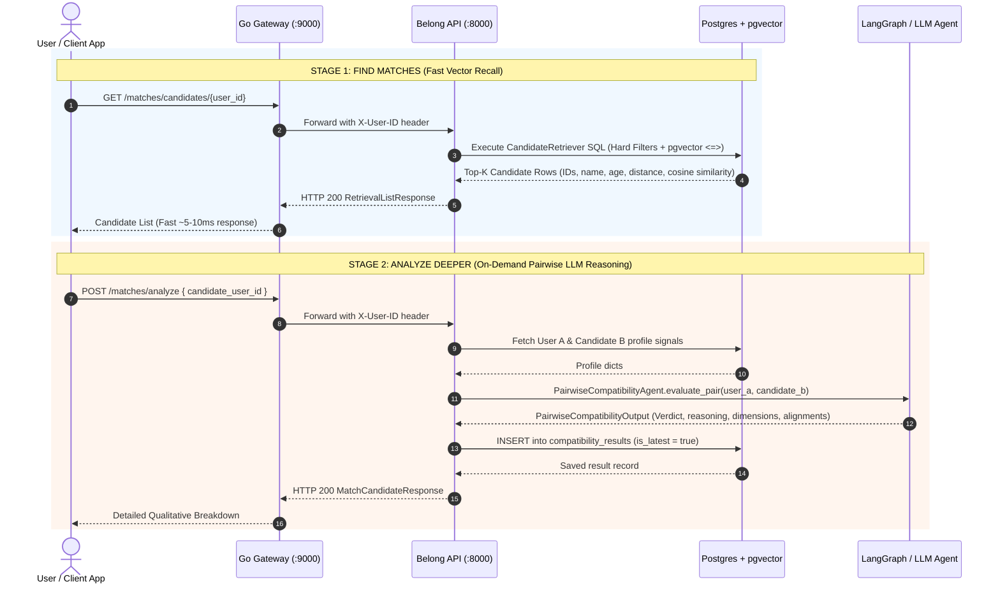

# Decoupled Matchmaking Architecture & Flow Document

## Executive Summary

The Belong matchmaking system uses a **decoupled, two-stage architecture**:
1. **Stage 1 (Find Matches - Fast Candidate Recall)**: Fetches top-$K$ compatible candidates directly from PostgreSQL using SQL hard constraints + `pgvector` embedding similarity.
2. **Stage 2 (Analyze Deeper - On-Demand LLM Matchmaking)**: Executes LangGraph pairwise LLM reasoning **only when the user explicitly requests deeper analysis** for a specific candidate.

---

## Service Responsibilities & System Architecture

| Service | Component | Responsibility |
| :--- | :--- | :--- |
| **Go Gateway** (`:9000`) | Auth Gateway | Authenticates JWT tokens and forwards `/matches/*` requests to `belong-api`. |
| **Belong API Service** (`:8000`) | **`belong-api` (FastAPI)** | **Handles real-time candidate fetching (`GET /matches/candidates/{user_id}`) AND on-demand LLM reasoning (`POST /matches/analyze`).** |
| **PostgreSQL + pgvector** (`:5432`) | Database | Stores profiles, 1536-d embeddings (`self_embedding`, `wants_embedding`), and `compatibility_results`. |
| **Embedding Worker** | `belong-workers` | **Background Worker ONLY**: Generates and updates 1536-d vectors when profiles are updated or onboarding completes. |
| **Matching Worker** | `belong-workers` | **Background Worker ONLY**: Processes batch matching queues via RabbitMQ (if batch mode is invoked). |

> [!NOTE]
> **Who handles candidate fetching?**
> Candidate fetching is handled **directly by the `belong-api` service** via `CandidateRetriever` (`belong-api/matching/retrieval.py`). The **embedding worker** is only responsible for generating vector embeddings when profiles change; it is not involved in real-time match retrieval queries.

---

## System Flow & Sequence Diagram

---

## Detailed Step-by-Step Execution

### Step 1: User Presses "Find Matches" (Stage 1 Candidate Retrieval)
1. User clicks **"Find Matches"** in the frontend.
2. The client calls `GET /matches/candidates/{user_id}` (or `POST /matches/candidates`).
3. `belong-api` executes `CandidateRetriever.retrieve_candidates()`:
   * Applies SQL hard constraint filters (gender preference, mutual age range, max distance haversine, relationship goals).
   * Ranks eligible candidates using `pgvector` distance (`p.self_embedding <=> %(wants_vec)s::vector`).
4. `belong-api` returns candidate profile previews, location distance, and vector similarity scores in **~5ms to 15ms**.
5. **No database rows are created** in `compatibility_results`. No LLM tokens are used.

### Step 2: User Inspects Candidates & Clicks "Analyze Deeper" (Stage 2 LLM Reasoning)
1. The user browses the candidate list and selects a specific candidate (Candidate B).
2. User clicks **"Analyze Deeper"**.
3. The client calls `POST /matches/analyze` with `candidate_user_id: "candidate-uuid"`.
4. `belong-api` executes `_perform_pairwise_llm_analysis()`:
   * Loads User A and Candidate B structured profile signals from PostgreSQL.
   * Invokes the `PairwiseCompatibilityAgent` (LangGraph reasoning graph).
   * Evaluates emotional needs, core values, lifestyle, conflict style, dealbreaker violations, and complementary alignments.
5. The result is persisted in `compatibility_results` with `is_latest = true`.
6. `belong-api` returns `MatchCandidateResponse` containing the full executive summary and dimensional breakdown.

---

## API Summary Table

| Endpoint | Method | Stage | Responsibilities & Behavior |
| :--- | :--- | :--- | :--- |
| `/matches/candidates/{user_id}` | `GET` | Stage 1 | Fast candidate retrieval via SQL + `pgvector`. **No LLM used**. |
| `/matches/candidates` | `POST` | Stage 1 | Candidate retrieval accepting request options body. **No LLM used**. |
| `/matches/analyze` | `POST` | Stage 2 | On-demand LLM reasoning for selected candidate. Stores result in DB. |
| `/matches/analyze/{candidate_user_id}` | `POST` | Stage 2 | Path-param variant for on-demand candidate LLM reasoning. |
| `/matches/details/pair/{candidate_user_id}` | `GET` | Query | Retrieves existing saved qualitative analysis for a candidate pair. |
| `/matches/{user_id}` | `GET` | Query | Retrieves all latest saved compatibility evaluations for user. |
