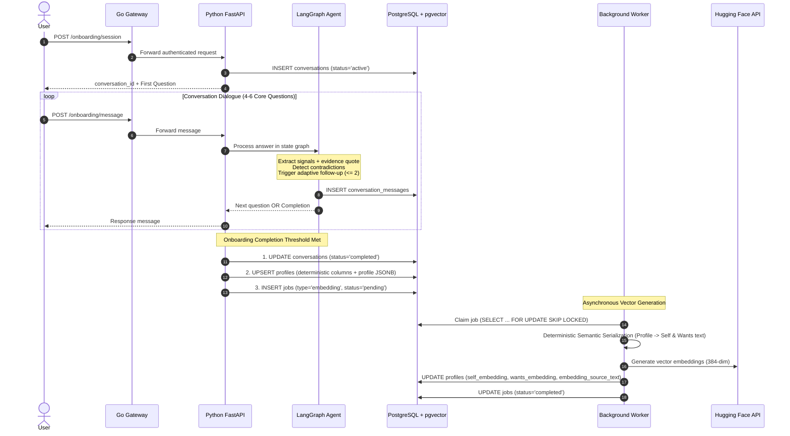

# Belong — Onboarding & Storage Architecture

## 1. High-Level Flow Overview

Belong's onboarding replaces generic static profile forms with an adaptive, conversational agent. The goal is to extract deep relational traits, emotional needs, and dealbreakers while grounding every claim in verifiable user statements.



---

## 2. The Conversational Dialogue Flow (LangGraph)

### 2.1 Core Question Areas (4–6 Questions)
1. **Relationship Intent**: What are you looking for in a relationship right now?
2. **Core Emotional Needs**: What do you most need from a partner when things get stressful or difficult?
3. **Offerings & Conflict Style**: How do you naturally handle disagreements, and what do you bring to a relationship?
4. **Lifestyle & Rhythm**: What does your day-to-day rhythm look like, and what values guide your choices?
5. **Non-Negotiables & Dealbreakers**: What are things that are absolute dealbreakers for you?

### 2.2 Adaptive Follow-Up Guardrails
- **Max Follow-ups Rule**: At most **2 adaptive follow-ups** across the entire onboarding session.
- **Trigger Conditions**: A follow-up is triggered *only* when:
  - An answer is overly vague (e.g., *"I just want a nice person"*).
  - A potential contradiction is detected between two statements.
- **Safety**: Never interrogate or trap the user. If an area remains unclear after one gentle probe, leave it marked as `uncertainty` rather than frustrating the user.

---

## 3. Evidence Traceability & Anti-Hallucination Policy

Every non-null trait extracted into the profile must be traceable back to verbatim quotes from the user:

```json
{
  "trait": "emotional_support",
  "category": "provides",
  "summary": "Prefers listening before attempting to fix things.",
  "evidence": {
    "quote": "I usually listen first rather than immediately trying to fix things.",
    "question_id": "q3"
  },
  "confidence": 0.92
}
```

- **Validation Rule**: The application validates that `evidence.quote` exists verbatim in `conversation_messages.content`.
- **Unknowns Policy**: If the user didn't mention a trait (e.g. financial goals), it remains empty or `null`. The model is strictly prohibited from inferring or inventing traits.

---

## 4. Storing Flow & Database Persistence

When the onboarding conversation completes, persistence occurs across three tables:

### 4.1 `conversations` & `conversation_messages`
- Captures dialogue history, timestamps, and full LangGraph checkpoint state.
- Supports auditability, debugging, and user resume capability.

### 4.2 `profiles`
The profile is saved with clear separation between deterministic SQL columns and nuanced LLM signals:

| Storage Layer | Fields | Purpose |
| :--- | :--- | :--- |
| **Deterministic SQL Columns** | `user_id`, `age`, `gender`, `orientation`, `latitude`, `longitude`, `relationship_goal`, `preferred_age_min`, `preferred_age_max`, `max_distance_km`, `preferred_genders` | Indexed for rapid SQL hard-constraint filtering during stage-1 retrieval. |
| **`profile` JSONB** | `self` (values, personality, lifestyle, provides), `wants` (needs, traits, expectations), `constraints` (dealbreakers), `contradictions` | Deep qualitative data used by the compatibility reasoning agent. |
| **Vector Columns** | `self_embedding VECTOR(384)`, `wants_embedding VECTOR(384)`, `embedding_source_text JSONB` | HNSW-indexed vector representations for fast semantic recall. |

### 4.3 `jobs` (Embedding Generation Task)
To ensure the user-facing API responds immediately without blocking on external Hugging Face inference calls:
1. An asynchronous job is inserted:
   ```sql
   INSERT INTO jobs (user_id, type, status, payload)
   VALUES ('<user_uuid>', 'embedding', 'pending', '{"user_id": "<user_uuid>"}');
   ```
2. The background worker claims the job atomically:
   ```sql
   UPDATE jobs 
   SET status = 'running', started_at = NOW(), attempts = attempts + 1
   WHERE id = (
       SELECT id FROM jobs 
       WHERE status = 'pending' AND type = 'embedding'
       ORDER BY created_at ASC 
       FOR UPDATE SKIP LOCKED 
       LIMIT 1
   ) RETURNING *;
   ```
3. Worker applies **Deterministic Semantic Serialization**, queries the Hugging Face API, saves vectors into `profiles`, and updates the job to `completed`.
