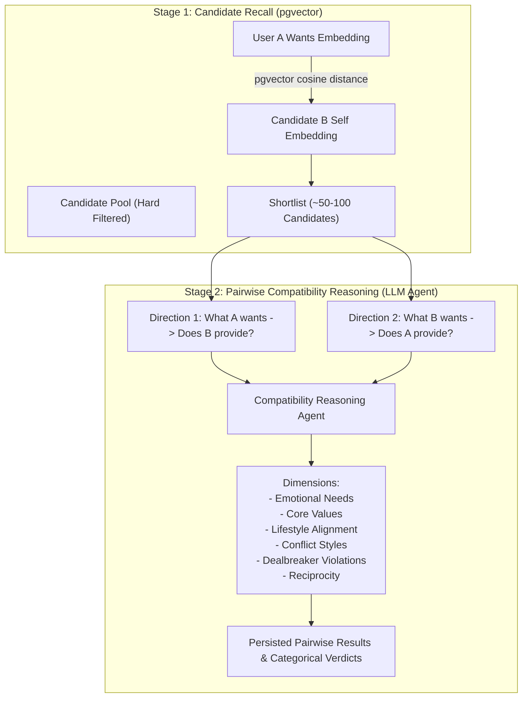

# Belong — Retrieval & Matchmaking Architecture

## 1. Core Architectural Principle: Recall vs. Compatibility

The fundamental differentiator of Belong is that **semantic similarity is strictly a candidate recall mechanism, not the compatibility mechanism**.

```
                           A wants text
                                ↓
                            embedding
                                ↓
                        cosine similarity
                                ↓
                           B self text
```

If a system stops at vector distance, it is doing **semantic similarity** — merely finding people whose self-descriptions sound similar to what someone wrote. But in human relationships:
- Being interested in someone and actually being compatible with them are two fundamentally different things.
- Two people liking the same music or books does not mean their emotional needs, conflict styles, or life directions align.
- **Vector search answers:** *"Does B's self-representation semantically resemble what A is looking for?"*
- It does **not** claim compatibility.

True compatibility is evaluated afterward through bidirectional, multi-dimensional reasoning.



---

## 2. Deterministic Semantic Serialization (Why NOT Freeform LLM Text)

A critical architectural flaw in naive vector systems is generating embedding text freeform with an LLM:

```
[Anti-Pattern]
Self Text  <-- Generated independently by LLM
Wants Text <-- Generated independently by LLM
```

### Why Freeform LLM Generation Fails
1. **Representation Mismatch**: Different LLM prompts or runs describe identical concepts using disparate vocabularies, sentence structures, or emotional registers.
2. **Non-Deterministic Noise**: An LLM might hallucinate adjectives, drop nuanced constraints, or introduce tone shifts between calls.
3. **Untestable Retrieval**: If the text generation varies randomly, you cannot reliably measure or optimize `Recall@100`.

### The Belong Solution: Separation of Concerns

- **LLM Responsibility**: Extract meaning from dialogue into a typed, validated **Structured Profile JSON**.
- **Code / Template Responsibility**: Transform Structured Profile JSON into **Embedding Texts** via a **Deterministic Semantic Serializer**.

```
Conversation / User Answers
            ↓
   LLM Meaning Extraction
            ↓
  Structured Profile JSON
            ↓
 ┌───────────────────────────────────────────────┐
 │       Deterministic Semantic Serializer       │
 │   (Fixed code-level syntactic templates)      │
 └──────────────────────┬────────────────────────┘
            ┌───────────┴───────────┐
            ▼                       ▼
      [SELF TEXT]              [WANTS TEXT]
            ↓                       ↓
  Hugging Face Model       Hugging Face Model
            ↓                       ↓
      self_embedding          wants_embedding
```

---

## 3. Semantic Pairing by Design

The deterministic serializer guarantees that the language used for a person's **offerings (`SELF`)** mirrors the linguistic patterns used for another person's **needs (`WANTS`)**.

### Concrete Example

Suppose User B's profile contains:
```yaml
provides:
  emotional_support: "listens when partner is struggling before offering advice"

conflict_style: "takes time to cool down before discussing disagreements"
```

The deterministic serializer for **`SELF TEXT`** outputs:
```text
What I offer in a relationship: I listen when my partner is struggling before offering advice.
How I handle conflict: I prefer taking time to cool down before discussing disagreements.
```

Now suppose User A's profile contains:
```yaml
wants:
  emotional_needs: "needs a partner who listens without immediately trying to fix things"

  conflict_preference: "someone who allows space to calm down rather than forcing immediate resolution"
```

The deterministic serializer for **`WANTS TEXT`** outputs:
```text
What I need from a partner: Someone who listens when I'm struggling before offering advice.
What I prefer during conflict: A partner who gives space to cool down before discussing disagreements.
```

Because both sentences use harmonized sentence frames generated by deterministic code templates:
1. The embedding model (`all-MiniLM-L6-v2` / `bge-base`) places both vectors close in embedding space.
2. Cosine similarity performs accurately on semantic intent.
3. You can tune the serializer templates directly and measure:
   > *"Does template version v2 improve Recall@100 on our synthetic benchmark dataset?"*

---

## 4. End-to-End Matchmaking Workflow

```
1. Client POST /matches
   - Receives 202 Accepted with job_id immediately.
   - Durably written to `jobs` table (status='pending').

2. Worker claims job via PostgreSQL row locking:
   SELECT * FROM jobs WHERE status = 'pending' 
   FOR UPDATE SKIP LOCKED LIMIT 1;

3. Step 1: Deterministic SQL Hard Filters
   - Target gender and orientation compatibility.
   - Age range constraints (User A range <-> User B age AND vice versa).
   - Maximum travel distance (calculated via coordinates / Haversine formula).
   - Required relationship goal matching.

4. Step 2: pgvector Candidate Recall
   - Query: User A wants_embedding
   - Target: Candidate pool self_embedding
   - Index: HNSW cosine distance (`<=>`)
   - Retrieves top 50–100 candidate profiles.

5. Step 3: Optional Pre-Rank Reduction
   - Score-based or rule-based filter to pick top 10–20 highest-potential candidates.

6. Step 4: Pairwise Compatibility Agent (LLM Reasoning)
   For each candidate:
   - Evaluate A wants ──> B provides
   - Evaluate B wants ──> A provides
   - Inspect dimensions: Emotional Needs, Values, Lifestyle, Conflict Style, Dealbreakers.
   - Produce strictly structured categorical verdicts:
     - `strong_alignment`
     - `partial_alignment`
     - `unclear` (evidence missing in profile)
     - `conflict`
   - Validate that all claims cite verbatim evidence quotes from the onboarding conversation.

7. Step 5: Persist Results & Complete Job
   - Write structured pairwise analysis to `compatibility_results`.
   - Update job status to `completed`.
   - Client polls GET /matches/jobs/{job_id} and receives rich compatibility cards.
```
